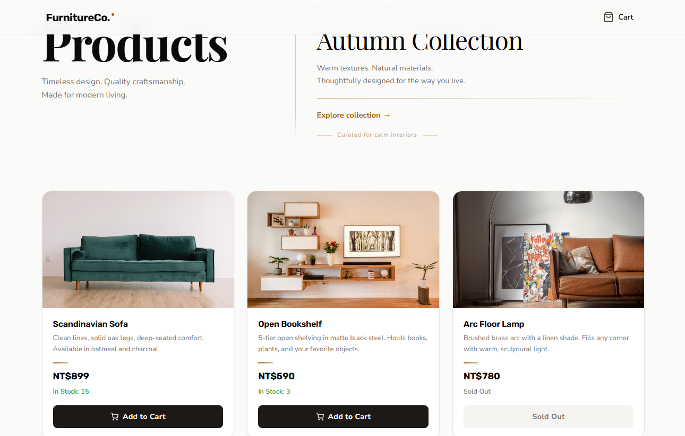
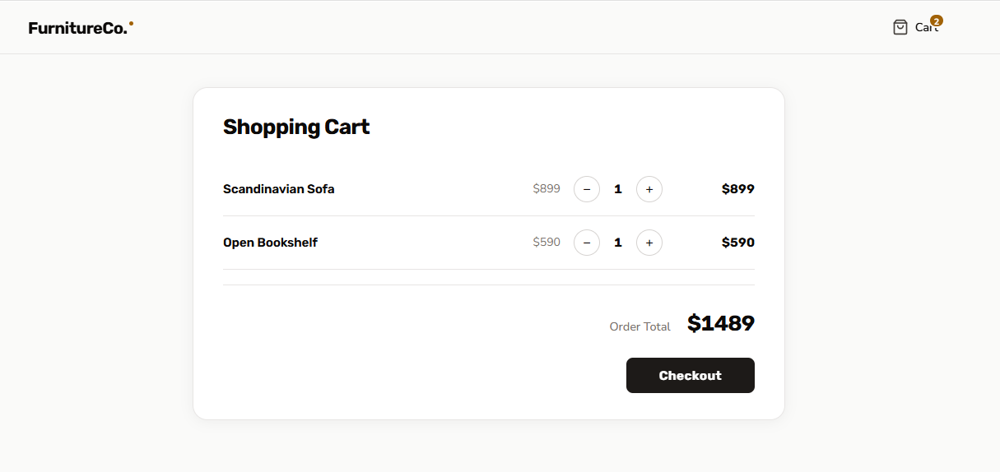
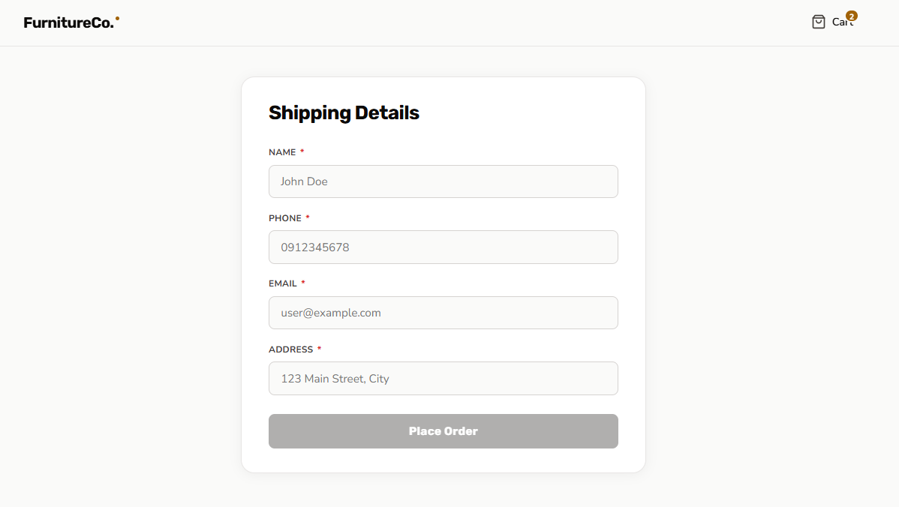
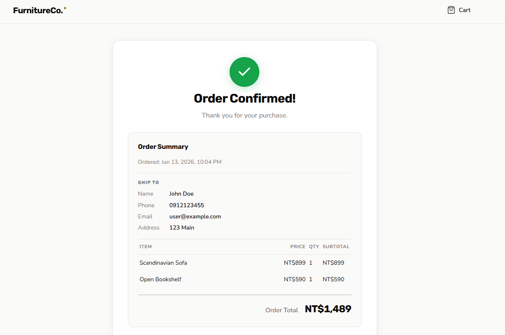

# Shopping Cart 購物車

依據**Claude Code 全端專案開發實作課程**做練習，使用 **Claude Code** 搭配 **Antigravity** 開發的全端購物車專案，採 **SDD（Spec-Driven Development，規格驅動開發）** 流程：**先寫規格 → 拆解任務 → 最後實作**。




---

## 技術棧

- **後端**：Java 17 + Spring Boot 3.x + Spring Data JPA
- **前端**：React + Vite
- **資料庫**：PostgreSQL 18
- **建置**：Maven（後端）／ npm（前端）
- **測試**：Testcontainers + JUnit 5（後端整合測試）／ Playwright（E2E 測試）

---

## 快速啟動

```powershell
# 首次啟動 或 有程式碼異動需要重新建置
```

| 指令 | 說明 |
|------|------|
| `docker compose down -v` | 停止並移除所有容器與 volume（含資料庫資料） |
| `docker compose up --build` | 重新建置 image 並啟動所有服務 |


---

## 開發方法：SDD（規格先行）

不直接寫程式，而是先把需求與規格定義清楚，讓 AI 依文件實作。流程如下：

1. **建立 [prd.md](prd.md)** — 描述產品需求（技術棧、核心實體、功能範圍）。
2. **依 prd.md 修改 [CLAUDE.md](CLAUDE.md)** — 設定專案開發規範與技術棧。
3. **撰寫 [spec.md](spec.md)** — 依需求產出規格。
4. **撰寫 [api.md](api.md)** — 定義 RESTful API 端點與請求/回應格式。
5. **拆分任務** — 用 TodoWrite 拆解任務，並建立 [todolist.md](todolist.md) 紀錄。
6. **請 AI 分析開發順序** — 分析任務相依與可平行的部分。
7. **開始實作** — 請 AI「根據 todolist.md / api.md / spec.md 開發」。
8. **撰寫測試** — E2E 測試（Playwright）驗證完整流程。
9. **agent-browser** - 使用 agent-browser 完整驗證本地購物流程，產出 reports/checkout-sop.md。
10. 建立 Agent Browser Checkout Skill 本專案結帳流程功能。
11. 使用 UI/UX Pro Max，優化介面設計。
12. 建立 pre-commit hook，在每次 commit 前自動執行 R1–R6 六條資安規則掃描。
13. 使用 /agents 建立背景 Agent，依照商品資料模型產生商品測試資料。


---

## 文件

| 文件 | 用途 |
|------|------|
| [prd.md](prd.md) | 產品需求 |
| [spec.md](spec.md) | 規格文件 |
| [api.md](api.md) | API 文件 |
| [CLAUDE.md](CLAUDE.md) | 開發規範 |
| [todolist.md](todolist.md) | 任務追蹤 |
| [reports/checkout-sop.md](reports/checkout-sop.md) | agent-browser 購物結帳流程 SOP |
| [.claude/skills/agent-browser/SKILL.md](.claude/skills/agent-browser/SKILL.md) | agent-browser-checkout skill（本專案結帳流程） |

---

## Claude Code Skills

### 使用者層級（`~/.claude/skills/`，跨專案可用）

| Skill | 觸發指令 | 說明 |
|-------|----------|------|
| `skill-creator` | `/skill-creator` | 引導建立新 Skill：收集名稱與用途，自動生成並安裝 SKILL.md |
| `agent-browser` | `/agent-browser` | agent-browser CLI 通用指南，含 React SPA 注意事項與疑難排解 |

### 專案層級（`.claude/skills/`，僅此專案）

| Skill | 觸發指令 | 說明 |
|-------|----------|------|
| `agent-browser-checkout` | `/agent-browser-checkout` | 本專案購物車結帳完整操作流程、驗證點與 API 格式備忘 |

> Skills 遵循 [agentskills.io](https://agentskills.io) 開放標準，本質是帶有 `SKILL.md` 的資料夾。

---

## 參考資料

- Claude Code 全端專案開發實作課程 (Kevin)
