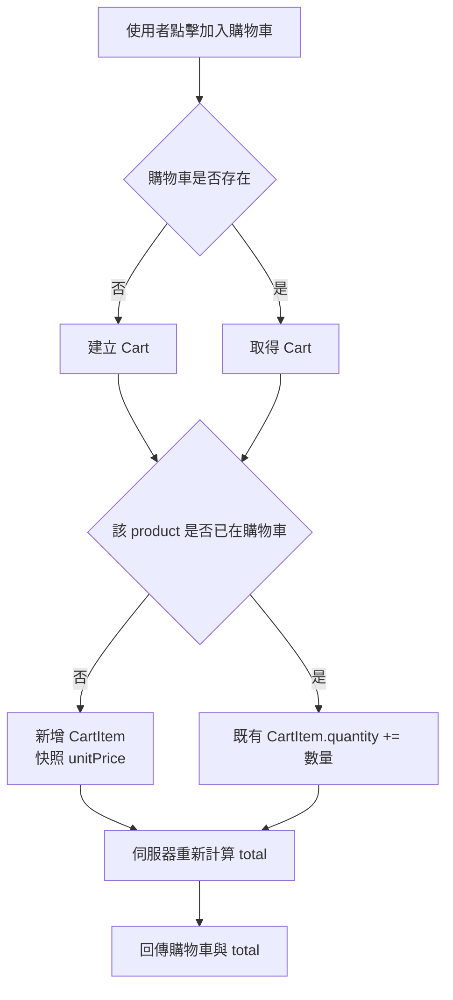
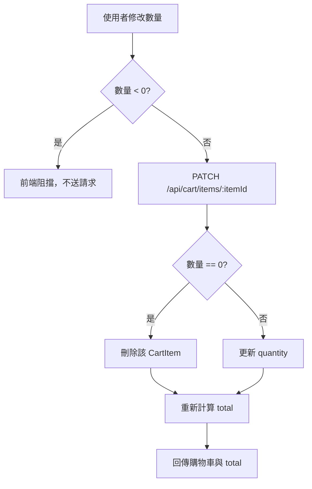
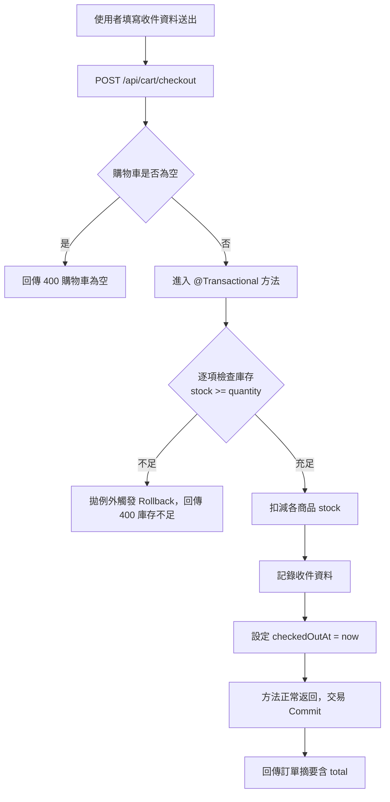
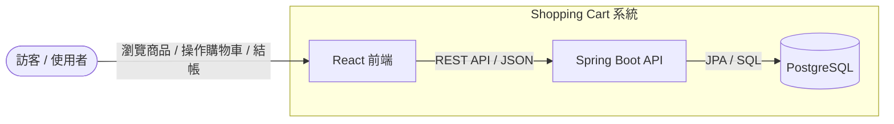
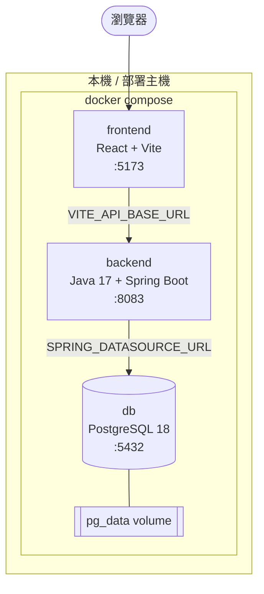
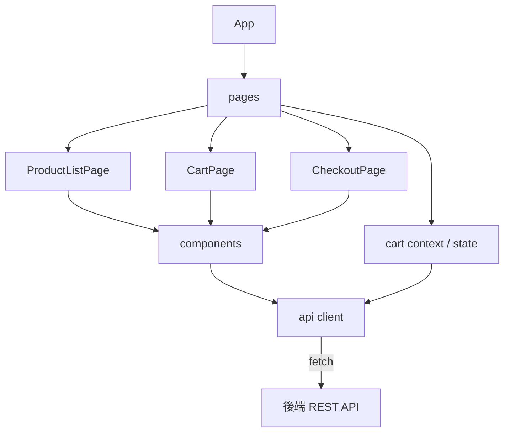
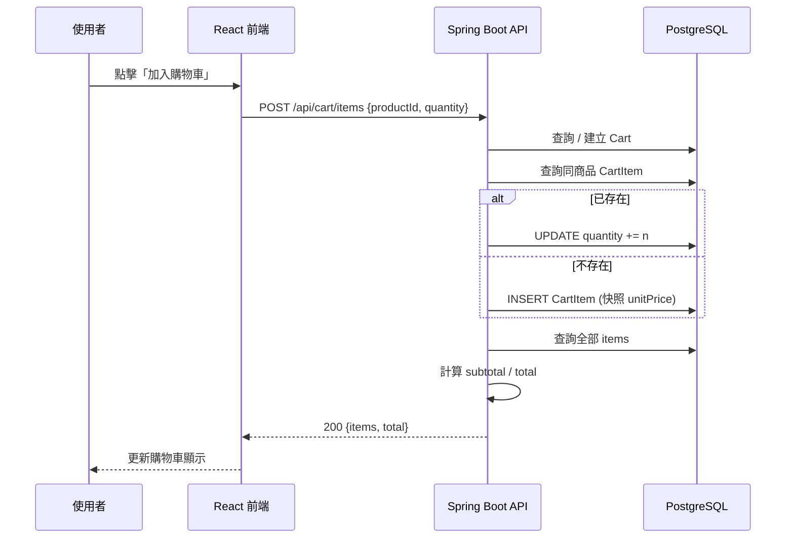
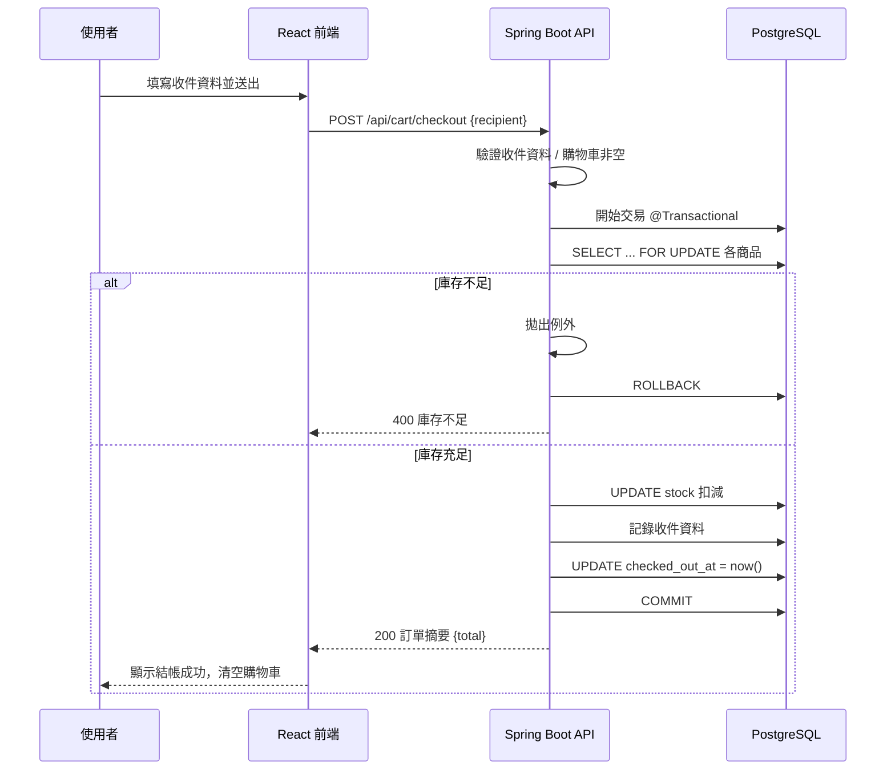
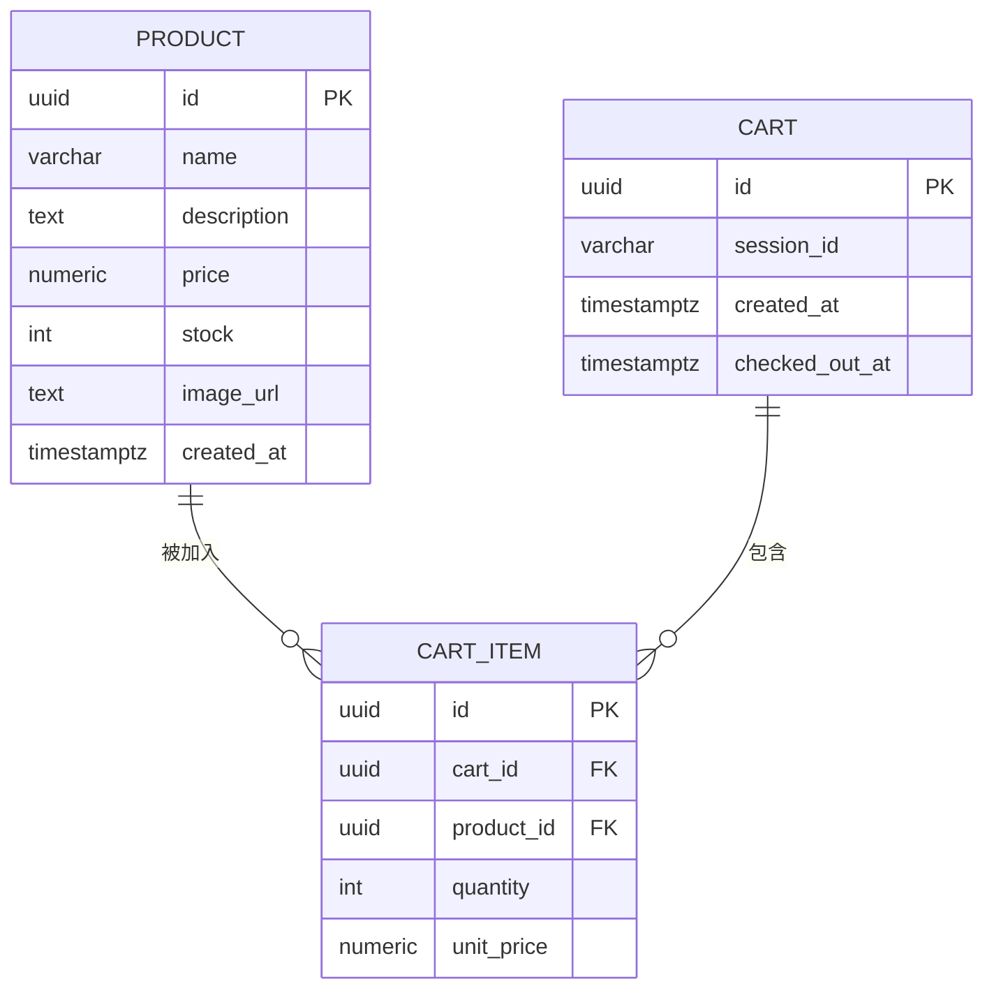
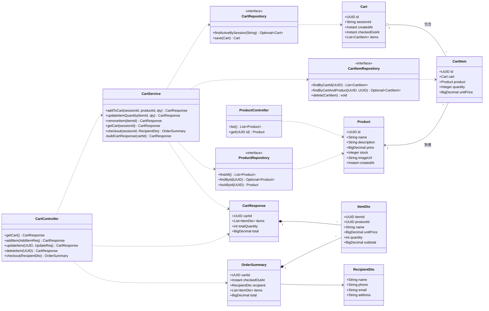

# 規格文件 — Shopping Cart 購物車系統

> 本文件依據 [prd.md](prd.md) 撰寫，作為開發前與開發者確認之規格依據。
> 流程圖一律使用 mermaid 製作。

---

## 1. 架構與選型

### 1.1 整體架構

採前後端分離的三層式架構（Client → API Server → Database）。

| 層級 | 技術 | 選型理由 |
|------|------|----------|
| 前端 | React + Vite | Vite 提供快速 HMR 與輕量打包；React 元件化利於購物車狀態管理 |
| 後端 | Java 17 + Spring Boot 3.x | 企業級成熟生態；Spring Data JPA 加速資料層開發；`@Transactional` 保證結帳一致性 |
| 資料庫 | PostgreSQL 18 | 交易（transaction）保證結帳一致性；NUMERIC 型別精確處理金額 |
| 建置 | Maven | pom.xml 設定直觀、生態普及 |
| 容器 | Docker（`docker compose`） | 一致的本機/部署環境，DB 一鍵啟動 |

### 1.2 關鍵設計原則

- **金額權威在伺服器**：購物車合計（total）、小計（subtotal）一律由後端計算回傳，API 不接受客戶端傳入金額。
- **單價快照**：商品加入購物車時，將當下 `price` 寫入 `CartItem.unitPrice`，避免商品調價影響既有購物車。
- **訪客 Session**：以 `sessionId`（cookie）識別訪客購物車，無需會員登入。
- **庫存驗證時機**：僅於「結帳」時檢查庫存，加入購物車時不檢查。

### 1.3 技術選型一覽

```
後端：Java 17 / Spring Boot 3.x / Spring Web / Spring Data JPA (Hibernate) / Bean Validation
前端：React / Vite / fetch 或 axios
資料庫：PostgreSQL 18
建置：Maven
容器：Docker + docker compose
JDK：C:\Program Files\Java\openjdk-17.0.12
```

---

## 2. 資料模型

> JPA Entity 欄位以 camelCase 命名，資料表欄位以 snake_case（透過命名策略對應）。

### 2.1 Product（商品）

| Entity 欄位 | 資料表欄位 | Java 型別 | DB 型別 / 約束 | 說明 |
|------|------|------|------|------|
| `id` | `id` | UUID | UUID PK | 主鍵 |
| `name` | `name` | String | VARCHAR(255) NOT NULL | 商品名稱 |
| `description` | `description` | String | TEXT | 商品描述 |
| `price` | `price` | BigDecimal | NUMERIC(10,2) NOT NULL，CHECK ≥ 0 | 單價（TWD） |
| `stock` | `stock` | Integer | INTEGER NOT NULL，CHECK ≥ 0 | 庫存數量 |
| `imageUrl` | `image_url` | String | TEXT | 商品圖片 URL |
| `createdAt` | `created_at` | Instant | TIMESTAMPTZ 預設 now() | 建立時間 |

### 2.2 Cart（購物車）

| Entity 欄位 | 資料表欄位 | Java 型別 | DB 型別 / 約束 | 說明 |
|------|------|------|------|------|
| `id` | `id` | UUID | UUID PK | 主鍵 |
| `sessionId` | `session_id` | String | VARCHAR(255) NOT NULL，INDEX | 訪客 session 識別 |
| `createdAt` | `created_at` | Instant | TIMESTAMPTZ 預設 now() | 建立時間 |
| `checkedOutAt` | `checked_out_at` | Instant | TIMESTAMPTZ NULL | 結帳時間（NULL 表未結帳） |
| `items` | — | List&lt;CartItem&gt; | `@OneToMany(mappedBy="cart")` | 明細關聯 |

### 2.3 CartItem（購物車明細）

| Entity 欄位 | 資料表欄位 | Java 型別 | DB 型別 / 約束 | 說明 |
|------|------|------|------|------|
| `id` | `id` | UUID | UUID PK | 主鍵 |
| `cart` | `cart_id` | Cart | `@ManyToOne` FK NOT NULL | 所屬購物車 |
| `product` | `product_id` | Product | `@ManyToOne` FK NOT NULL | 對應商品 |
| `quantity` | `quantity` | Integer | INTEGER NOT NULL，CHECK ≥ 1 | 數量 |
| `unitPrice` | `unit_price` | BigDecimal | NUMERIC(10,2) NOT NULL | 加入當下快照單價 |

> 唯一約束：`@UniqueConstraint(columnNames = {"cart_id", "product_id"})` — 確保同一購物車中同商品僅一列，達成「自動合併數量」。

詳細關聯見 [§9 ER 圖](#9-er-圖)。

---

## 3. 關鍵流程

### 3.1 加入購物車（自動合併）



### 3.2 更新數量（0 則移除）



### 3.3 結帳流程



---

## 4. 虛擬碼

> 以 Spring Boot Service 層表示，註解使用中文。

### 4.1 加入購物車

```java
// 加入商品至購物車，若已存在則合併數量
@Transactional
CartResponse addToCart(String sessionId, UUID productId, int quantity) {
    Cart cart = cartRepo.findActiveBySession(sessionId)
                        .orElseGet(() -> cartRepo.save(new Cart(sessionId)));
    Product product = productRepo.findById(productId)
                        .orElseThrow(() -> new NotFoundException());

    cartItemRepo.findByCartAndProduct(cart.getId(), productId)
        .ifPresentOrElse(
            item -> item.setQuantity(item.getQuantity() + quantity),   // 自動合併
            ()   -> cartItemRepo.save(new CartItem(cart, product, quantity, product.getPrice())) // 快照單價
        );

    return buildCartResponse(cart.getId());   // total 由伺服器計算
}
```

### 4.2 更新數量

```java
// 更新明細數量，數量為 0 則移除
@Transactional
CartResponse updateItemQuantity(UUID itemId, int quantity) {
    if (quantity < 0) throw new BadRequestException();   // 防呆（前端亦阻擋）
    CartItem item = cartItemRepo.findById(itemId)
                        .orElseThrow(() -> new NotFoundException());

    if (quantity == 0) {
        cartItemRepo.delete(item);            // 數量 0 自動移除
    } else {
        item.setQuantity(quantity);
    }
    return buildCartResponse(item.getCart().getId());
}
```

### 4.3 計算合計（伺服器權威）

```java
// 建立購物車回應，subtotal 與 total 一律由伺服器計算
CartResponse buildCartResponse(UUID cartId) {
    List<CartItem> items = cartItemRepo.findByCartId(cartId);
    List<ItemDto> dtos = items.stream().map(it -> {
        BigDecimal subtotal = it.getUnitPrice().multiply(BigDecimal.valueOf(it.getQuantity()));
        return new ItemDto(it, subtotal);
    }).toList();
    BigDecimal total = dtos.stream()
                           .map(ItemDto::subtotal)
                           .reduce(BigDecimal.ZERO, BigDecimal::add);   // 不接受客戶端傳入
    return new CartResponse(cartId, dtos, total);
}
```

### 4.4 結帳

```java
// 結帳：驗證、鎖庫存、扣減、記錄收件資料、清空（標記已結帳）
@Transactional
OrderSummary checkout(String sessionId, RecipientDto recipient) {
    validate(recipient);                       // Bean Validation：name/phone/email/address
    Cart cart = cartRepo.findActiveBySession(sessionId)
                        .orElseThrow(() -> new BadRequestException());
    List<CartItem> items = cartItemRepo.findByCartId(cart.getId());
    if (items.isEmpty()) throw new BadRequestException("購物車為空");

    for (CartItem it : items) {
        Product p = productRepo.lockById(it.getProduct().getId());   // SELECT ... FOR UPDATE
        if (p.getStock() < it.getQuantity()) throw new BadRequestException("庫存不足"); // 觸發 rollback
        p.setStock(p.getStock() - it.getQuantity());                 // 扣減庫存
    }
    saveRecipient(cart.getId(), recipient);
    cart.setCheckedOutAt(Instant.now());        // 標記已結帳 -> 購物車清空
    return new OrderSummary(cart, items, buildCartResponse(cart.getId()).total());
}
```

---

## 5. 系統脈絡圖



---

## 6. 容器/部署概觀



部署要點：

- 提供 `docker-compose.yml`（以 `docker compose up` 啟動）。
- 後端讀取環境變數 `SPRING_DATASOURCE_URL` / `SPRING_DATASOURCE_USERNAME` / `SPRING_DATASOURCE_PASSWORD`；前端讀取 `VITE_API_BASE_URL`。
- 後端以多階段 Dockerfile（Maven build → JRE 17 runtime）打包。
- DB 資料以具名 volume（`pg_data`）持久化。

---

## 7. 模組關係圖（Backend / Frontend）

### 7.1 Backend（Spring Boot 分層）

```mermaid
graph TD
    C[Controller<br/>@RestController] --> S[Service<br/>@Service]
    S --> Repo[Repository<br/>Spring Data JPA]
    Repo --> DBpg[(PostgreSQL)]
    S --> Calc[CartCalculator<br/>合計計算]
    C --> EH[GlobalExceptionHandler<br/>@RestControllerAdvice]
    C --> Val[Bean Validation<br/>@Valid]
    F[SessionFilter<br/>session 識別] --> C
```

| 模組 | 職責 |
|------|------|
| Controller | 接收 HTTP 請求、回傳回應，不含商業邏輯 |
| Service | 商業邏輯（加入合併、移除、結帳、合計），標註 `@Transactional` |
| Repository | Spring Data JPA 資料存取介面 |
| CartCalculator | 計算 subtotal / total（伺服器權威） |
| GlobalExceptionHandler | 統一例外轉 HTTP 狀態碼 |
| SessionFilter | 由 cookie 解析 / 建立 sessionId |

### 7.2 Frontend



---

## 8. 序列圖

### 8.1 加入購物車



### 8.2 結帳



---

## 9. ER 圖



---

## 10. 類別圖（Class Diagram）

呈現後端 Spring Boot 主要類別（Entity / DTO / Controller / Service / Repository）的屬性、方法與關聯。



> 說明：`CartResponse` / `ItemDto` / `OrderSummary` / `RecipientDto` 為傳輸用 DTO（金額由伺服器計算後填入）；Repository 為 Spring Data JPA 介面。

---

## 11. 畫面設計與互動

### 11.1 頁面清單

| 頁面 | 路由 | 說明 |
|------|------|------|
| 商品列表頁 | `/` | 卡片列表呈現所有商品，含「加入購物車」按鈕 |
| 購物車頁 | `/cart` | 明細列表、數量調整、伺服器合計 |
| 結帳頁 | `/checkout` | 收件資料表單 |
| 結帳成功頁 | `/checkout/success` | 訂單摘要，購物車已清空 |

所有頁面頂部共用 **導覽列（NavBar）**，右側固定顯示購物車圖示與數量徽章。

### 11.2 共用導覽列（含購物車徽章）

```
┌──────────────────────────────────────────────┐
│  🛒 Shopping Cart            [🛒 商品]  ( 3 )  │  ← 徽章顯示購物車件數
└──────────────────────────────────────────────┘
```

- 徽章數字 = 購物車內所有 `CartItem.quantity` 加總（由 `GET /api/cart` 回傳資料計算）。
- 件數為 0 時隱藏徽章。

### 11.3 商品列表頁（Wireframe）

```
┌──────────────────────────────────────────────┐
│  NavBar                            [🛒] ( 2 )  │
├──────────────────────────────────────────────┤
│  ┌──────────┐  ┌──────────┐  ┌──────────┐    │
│  │ [圖片]   │  │ [圖片]   │  │ [圖片]   │    │
│  │ 商品 A   │  │ 商品 B   │  │ 商品 C   │    │
│  │ $299     │  │ $499     │  │ $159     │    │
│  │ 庫存 12  │  │ 庫存 5   │  │ 庫存 0   │    │
│  │[加入購物車]│ │[加入購物車]│ │[ 已售完 ]│    │
│  └──────────┘  └──────────┘  └──────────┘    │
└──────────────────────────────────────────────┘
```

### 11.4 購物車頁（Wireframe）

```
┌──────────────────────────────────────────────┐
│  購物車                                        │
├──────────────────────────────────────────────┤
│  商品 A    $299   [ − ] 2 [ + ]   小計 $598   │
│  商品 B    $499   [ − ] 1 [ + ]   小計 $499   │
│  ──────────────────────────────────────────   │
│                          合計（伺服器）$1097   │
│                                  [ 前往結帳 ]   │
└──────────────────────────────────────────────┘
```

- 小計、合計皆顯示伺服器回傳值，前端不自行加總。
- 數量降到 0（連按 `−`）→ 該列淡出移除。

### 11.5 結帳頁與成功頁

- **結帳頁**：收件表單（姓名、電話、Email、地址），欄位即時驗證；送出鈕在表單有效時才可點擊。
- **成功頁**：顯示訂單摘要（品項、合計），導覽列徽章歸零（購物車已清空）。

### 11.6 視覺與互動規範

- 動畫時長建議 150–300ms，使用 CSS transition / transform，避免阻塞操作。
- 所有金額顯示一律來自伺服器回應，前端僅負責呈現。
- 互動需具無障礙考量：徽章數字變更時更新 `aria-label`（如「購物車 3 件」）。

---

## 12. 範圍邊界（對應 PRD）

**包含**：商品瀏覽、加入購物車（合併）、數量更新（0 移除）、伺服器合計、結帳清空。

**不包含**：會員登入、金流串接、訂單歷史查詢、後台管理、折扣碼。

---

> 後續：API 細節請見 `api.md`（RESTful 風格）。開發前請就本規格與開發者確認。
