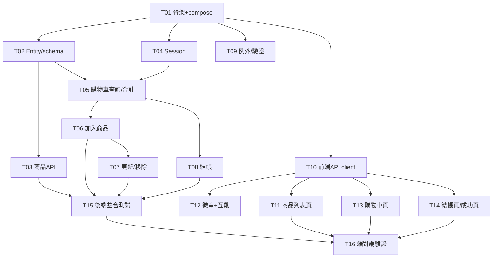

# TodoList — Shopping Cart 購物車系統

> 依據 [spec.md](spec.md)、[api.md](api.md) 拆分。每項任務可獨立開發、互不干擾。
> 規則（依 [CLAUDE.md](CLAUDE.md)）：開始任務前標記進行中、完成且通過測試後才勾選完成並進下一項。
>
> 任務狀態圖例（三態追蹤）：□ 待辦 ｜ ◐ 進行中 ｜ ☑ 完成

---

## 📄 現有文件

- [prd.md](prd.md) — 產品需求
- [spec.md](spec.md) — 規格文件
- [api.md](api.md) — API 文件
- [CLAUDE.md](CLAUDE.md) — 開發規範
- [todolist.md](todolist.md) — 任務追蹤

---

## 🔀 平行開發分析（subagent 同步）

前提：**API 合約（[api.md](api.md)）已定稿**，前端可依合約與後端同步開發。
平行原則：觸及**不同檔案**的任務可同時進行；會改到**同一類別/檔案**的必須串行。

### 波次規劃

| 波次 | 可平行任務 | 建議 subagent | 阻塞點 |
|------|-----------|--------------|--------|
| **Wave 0** | T01 | 1 個（單獨先行） | 全部任務的前置 |
| **Wave 1** | T02 ＋ (T04 + T09) ＋ T10 | 3 個並行 | 需 T01 完成 |
| **Wave 2** | (T05→T06→T07→T08) ＋ T03 ＋ (T11/T12/T13/T14) | 3+ 個並行 | 需 Wave 1 完成 |
| **Wave 3** | T15 ＋ T16 | 1–2 個 | 需 Wave 2 完成 |

### 平行軌道（Track）說明

- **Track BE-Cart（串行）**：T02 → T05 → T06 → T07 → T08
  共用 `CartService` / Entity，**由同一個 subagent 依序處理**，避免衝突。
- **Track BE-Product（獨立）**：T03（僅需 T02 的 Entity）→ 可獨立 subagent。
- **Track BE-CrossCut（獨立）**：T04、T09 為橫切關注點，僅需骨架 → 可獨立 subagent。
- **Track FE（半獨立）**：T10 先行；之後 T11、T12、T13、T14 為不同頁面/元件，可拆給多個 subagent（共用 cart context 需約定介面）。

### 相依圖



---

## 🏗️ 基礎建設

- ☑ **T01** `[Wave 0]` `依賴:無` 建立專案骨架：後端 Spring Boot（Maven, Java 17）+ 前端 Vite（React）+ `docker-compose.yml`（PostgreSQL 18、後端埠 8083）

## ⚙️ 後端（Spring Boot）

- ☑ **T02** `[Wave 1]` `依賴:T01` `軌道:BE-Cart` 定義 JPA Entity（Product / Cart / CartItem）與唯一約束 + 資料庫 schema/seed
- ☑ **T03** `[Wave 2]` `依賴:T02` `軌道:BE-Product` 商品 API（`GET /api/products`、`GET /api/products/{id}`）
- ☑ **T04** `[Wave 1]` `依賴:T01` `軌道:BE-CrossCut` Session 識別機制（cookie `SESSION_ID` 過濾器）
- ☑ **T05** `[Wave 2]` `依賴:T02,T04` `軌道:BE-Cart` 購物車查詢與合計計算（`GET /api/cart`，伺服器權威 total/subtotal/totalQuantity）
- ☑ **T06** `[Wave 2]` `依賴:T05` `軌道:BE-Cart` 加入商品 API（`POST /api/cart/items`，自動合併數量 + 單價快照）
- ☑ **T07** `[Wave 2]` `依賴:T06` `軌道:BE-Cart` 更新與移除明細 API（`PATCH` 數量 0 自動移除、`DELETE`）
- ☑ **T08** `[Wave 2]` `依賴:T05` `軌道:BE-Cart` 結帳 API（`POST /api/cart/checkout`，`@Transactional` 鎖庫存扣減、收件驗證、清空購物車）
- ☑ **T09** `[Wave 1]` `依賴:T01` `軌道:BE-CrossCut` 統一例外處理（GlobalExceptionHandler）與 Bean Validation

## 🎨 前端（React + Vite）

- ☑ **T10** `[Wave 1]` `依賴:T01` `軌道:FE` API client 與 CORS 串接（`VITE_API_BASE_URL` 指向 8083，fetch `credentials: include`）
- ☑ **T11** `[Wave 2]` `依賴:T10` `軌道:FE` 商品列表頁（卡片、加入購物車、售完狀態）
- ☑ **T12** `[Wave 2]` `依賴:T10` `軌道:FE` 導覽列購物車徽章 + 加入時遞增小互動（彈跳／晃動／Toast）⭐
- ☑ **T13** `[Wave 2]` `依賴:T10` `軌道:FE` 購物車頁（明細、數量增減、0 移除、顯示伺服器合計）
- ☑ **T14** `[Wave 2]` `依賴:T10` `軌道:FE` 結帳頁與結帳成功頁（收件表單驗證、清空後導向成功頁）

## ✅ 測試

- ☑ **T15** `[Wave 3]` `依賴:T03,T06,T07,T08` 後端 API 整合測試（合併、0 移除、合計、庫存不足、空車結帳）
- ☑ **T16** `[Wave 3]` `依賴:T11,T13,T14,T15` 端對端流程驗證（瀏覽 → 加入 → 調整 → 結帳清空）

## 🚀 CI/CD 與部署

- □ **T17** `[Wave 4]` `依賴:T16` 建立 `.gitignore`、初始化 Git 儲存庫，並推送至 GitHub（`https://github.com/chtseng93/claude-shopping-cart.git`）
- □ **T18** `[Wave 4]` `依賴:T17` 建立 GitHub Actions CI/CD 工作流程（`.github/workflows/`）：後端 Maven Build + Test、前端 npm Build + Lint、合併主線後觸發 Render 部署
- □ **T19** `[Wave 4]` `依賴:T17` 建立 Render 部署設定（`render.yaml`）：PostgreSQL 資料庫、後端 Web Service（Docker）、前端 Static Site（Docker/Nginx）

---

## T16 測試實作紀錄

### 新增檔案
| 檔案 | 說明 |
|------|------|
| `e2e/package.json` | Playwright 專案設定（`@playwright/test ^1.60.0`） |
| `e2e/playwright.config.ts` | 測試設定（baseURL、headless、screenshot: on、HTML 報告） |
| `e2e/tests/shopping-flow.spec.ts` | 8 個端對端測試案例 |

### playwright.config.ts 重點設定
```typescript
reporter: [['list'], ['html', { open: 'on-failure' }]]
use: {
  baseURL: 'http://localhost:5173',
  headless: true,
  screenshot: 'on',      // 每個測試都截圖
  video: 'retain-on-failure',
}
```

### 測試案例（shopping-flow.spec.ts）— 8/8 全部通過 ✅

| # | 測試名稱 | 涵蓋功能 | 斷言重點 |
|---|---------|---------|---------|
| 1 | 商品列表頁正確顯示 5 項商品 | PLP 卡片數量、頁面標題 | `.plp-card` count = 5、`.plp-title` = "Products" |
| 2 | NavBar 顯示 FurnitureCo. 品牌名稱 | 品牌 logo 文字 | `.navbar__logo` = "FurnitureCo." |
| 3 | 加入有庫存的商品後，NavBar 徽章更新 | Add to Cart → 徽章遞增 | `.navbar__badge` 可見且文字 = "1" |
| 4 | 購物車頁顯示已加入的商品 | 加入後導覽至 /cart | `.cart-item-row` count = 1 |
| 5 | 購物車頁可調整數量（+1） | qty-btn 遞增 | `.qty-value` 從 1 → 2 |
| 6 | 購物車頁可減少數量（數量歸零自動移除） | qty-btn 遞減至 0 → 自動移除 | `.cart-empty-msg` 可見 |
| 7 | 售完商品按鈕顯示 Sold Out 且不可點擊 | sold-out 狀態 | `.plp-btn--sold-out` 文字 = "Sold Out"、disabled |
| 8 | 完整結帳流程：加入→購物車→填表單→成功頁 | 端對端完整流程 | URL = /checkout/success、`.success-title` = "Order Confirmed!"、`.success-items tbody tr` count = 1、`.navbar__badge` 不可見（購物車清空） |

### 執行方式
```powershell
cd d:\claude\shopping-cart\e2e
npx playwright test                        # 無頭（headless）
npx playwright test --headed               # 有頭（可視化）
npx playwright test --headed --reporter=html  # 有頭 + 執行完自動產生 HTML 報告
npx playwright show-report                 # 開啟上次產生的 HTML 報告
```

---

## T15 測試實作紀錄

### 新增檔案
| 檔案 | 說明 |
|------|------|
| `backend/pom.xml` | 加入 Testcontainers（`junit-jupiter` + `postgresql`）依賴 |
| `backend/src/test/resources/application.yml` | 測試環境覆寫（`ddl-auto: none`、`sql.init.mode: always`） |
| `backend/src/test/java/.../CartApiIntegrationTest.java` | 購物車 API 整合測試（11 個測試案例） |
| `backend/src/test/java/.../ProductApiIntegrationTest.java` | 商品 API 整合測試（3 個測試案例） |

### CartApiIntegrationTest 涵蓋案例
- 空購物車查詢 → 200，items 空清單，total=0
- 加入商品 → 201，合計正確
- 相同商品加入兩次 → 自動合併數量，明細僅一筆
- 多種商品加入 → 合計為各小計加總
- PATCH 更新數量 → 200，數量改為指定值
- PATCH 數量設 0 → 自動移除明細
- DELETE 刪除明細 → 200，購物車僅剩其他明細
- 結帳成功 → 200，庫存扣減，購物車清空
- 庫存不足結帳 → 400，庫存不扣減（rollback 驗證）
- 空購物車結帳 → 400
- 加入不存在商品 → 404

---

## 進度紀錄

| 日期 | 任務 | 異動 |
|------|------|------|
| 2026-06-03 | — | 建立 todolist |
| 2026-06-03 | 全部 | 新增平行開發分析（Wave 0–3、相依圖） |
| 2026-06-03 | 全部 | 狀態改用三態圖示追蹤（□ / ◐ / ☑） |
| 2026-06-03 | T01–T14 | Wave 0 / Wave 1 / Wave 2 全部完成（subagent 平行開發） |
| 2026-06-03 | — | 關機前存檔；Wave 3（T15/T16）待下次繼續 |
| 2026-06-03 | T15 | 撰寫整合測試程式（Testcontainers + 14 個測試案例），尚未執行驗證 |
| 2026-06-04 | UI  | 全站英文化、家具主題（FurnitureCo. 黑白極簡風）、Arc Floor Lamp 圖片修正，docker compose rebuild 完成 |
| 2026-06-04 | T15 | 整合測試全部通過（15/15），修正 BackendApplicationTests + ProductApiIntegrationTest 舊商品名稱斷言 |
| 2026-06-04 | T16 | Playwright E2E 全部通過（8/8），修正 toHaveCount 型別錯誤及 tbody 選擇器，完成所有測試 |
| 2026-06-04 | — | 新增 T17–T19（CI/CD + Git 上傳 + Render 部署），待下次執行 |

