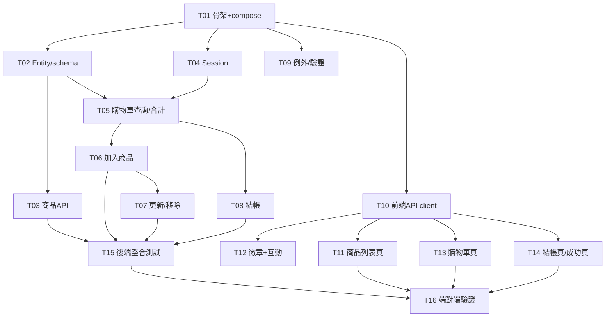

# TodoList — Shopping Cart 購物車系統

> 依據 [spec.md](spec.md)、[api.md](api.md) 拆分。每項任務可獨立開發、互不干擾。
> 規則（依 [CLAUDE.md](CLAUDE.md)）：開始任務前標記進行中、完成且通過測試後才勾選完成並進下一項。
>
> 任務狀態圖例（三態追蹤）：□ 待辦 ｜ ◐ 進行中 ｜ ☑ 完成

---

## 📄 現有文件

- [prd.md](prd.md) — 產品需求
- [spec.md](spec.md) — 規格文件
- [api.md](api.md) — API 文件
- [CLAUDE.md](CLAUDE.md) — 開發規範
- [todolist.md](todolist.md) — 任務追蹤

---

## 🔀 平行開發分析（subagent 同步）

前提：**API 合約（[api.md](api.md)）已定稿**，前端可依合約與後端同步開發。
平行原則：觸及**不同檔案**的任務可同時進行；會改到**同一類別/檔案**的必須串行。

### 波次規劃

| 波次 | 可平行任務 | 建議 subagent | 阻塞點 |
|------|-----------|--------------|--------|
| **Wave 0** | T01 | 1 個（單獨先行） | 全部任務的前置 |
| **Wave 1** | T02 ＋ (T04 + T09) ＋ T10 | 3 個並行 | 需 T01 完成 |
| **Wave 2** | (T05→T06→T07→T08) ＋ T03 ＋ (T11/T12/T13/T14) | 3+ 個並行 | 需 Wave 1 完成 |
| **Wave 3** | T15 ＋ T16 | 1–2 個 | 需 Wave 2 完成 |

### 平行軌道（Track）說明

- **Track BE-Cart（串行）**：T02 → T05 → T06 → T07 → T08
  共用 `CartService` / Entity，**由同一個 subagent 依序處理**，避免衝突。
- **Track BE-Product（獨立）**：T03（僅需 T02 的 Entity）→ 可獨立 subagent。
- **Track BE-CrossCut（獨立）**：T04、T09 為橫切關注點，僅需骨架 → 可獨立 subagent。
- **Track FE（半獨立）**：T10 先行；之後 T11、T12、T13、T14 為不同頁面/元件，可拆給多個 subagent（共用 cart context 需約定介面）。

### 相依圖



---

## 🏗️ 基礎建設

- ☑ **T01** `[Wave 0]` `依賴:無` 建立專案骨架：後端 Spring Boot（Maven, Java 17）+ 前端 Vite（React）+ `docker-compose.yml`（PostgreSQL 18、後端埠 8083）

## ⚙️ 後端（Spring Boot）

- ☑ **T02** `[Wave 1]` `依賴:T01` `軌道:BE-Cart` 定義 JPA Entity（Product / Cart / CartItem）與唯一約束 + 資料庫 schema/seed
- ☑ **T03** `[Wave 2]` `依賴:T02` `軌道:BE-Product` 商品 API（`GET /api/products`、`GET /api/products/{id}`）
- ☑ **T04** `[Wave 1]` `依賴:T01` `軌道:BE-CrossCut` Session 識別機制（cookie `SESSION_ID` 過濾器）
- ☑ **T05** `[Wave 2]` `依賴:T02,T04` `軌道:BE-Cart` 購物車查詢與合計計算（`GET /api/cart`，伺服器權威 total/subtotal/totalQuantity）
- ☑ **T06** `[Wave 2]` `依賴:T05` `軌道:BE-Cart` 加入商品 API（`POST /api/cart/items`，自動合併數量 + 單價快照）
- ☑ **T07** `[Wave 2]` `依賴:T06` `軌道:BE-Cart` 更新與移除明細 API（`PATCH` 數量 0 自動移除、`DELETE`）
- ☑ **T08** `[Wave 2]` `依賴:T05` `軌道:BE-Cart` 結帳 API（`POST /api/cart/checkout`，`@Transactional` 鎖庫存扣減、收件驗證、清空購物車）
- ☑ **T09** `[Wave 1]` `依賴:T01` `軌道:BE-CrossCut` 統一例外處理（GlobalExceptionHandler）與 Bean Validation

## 🎨 前端（React + Vite）

- ☑ **T10** `[Wave 1]` `依賴:T01` `軌道:FE` API client 與 CORS 串接（`VITE_API_BASE_URL` 指向 8083，fetch `credentials: include`）
- ☑ **T11** `[Wave 2]` `依賴:T10` `軌道:FE` 商品列表頁（卡片、加入購物車、售完狀態）
- ☑ **T12** `[Wave 2]` `依賴:T10` `軌道:FE` 導覽列購物車徽章 + 加入時遞增小互動（彈跳／晃動／Toast）⭐
- ☑ **T13** `[Wave 2]` `依賴:T10` `軌道:FE` 購物車頁（明細、數量增減、0 移除、顯示伺服器合計）
- ☑ **T14** `[Wave 2]` `依賴:T10` `軌道:FE` 結帳頁與結帳成功頁（收件表單驗證、清空後導向成功頁）

## ✅ 測試

- ☑ **T15** `[Wave 3]` `依賴:T03,T06,T07,T08` 後端 API 整合測試（合併、0 移除、合計、庫存不足、空車結帳）
- ☑ **T16** `[Wave 3]` `依賴:T11,T13,T14,T15` 端對端流程驗證（瀏覽 → 加入 → 調整 → 結帳清空）

## 🚀 CI/CD 與部署

- ☑ **T17** `[Wave 4]` `依賴:T16` 建立 `.gitignore`、初始化 Git 儲存庫，並推送至 GitHub（`https://github.com/chtseng93/claude-shopping-cart.git`）
- ☑ **T18** `[Wave 4]` `依賴:T17` 建立 GitHub Actions CI/CD 工作流程（`.github/workflows/`）：後端 Maven Build + Test、前端 npm Build + Lint、合併主線後觸發 Render 部署
- □ **T19** `[Wave 4]` `依賴:T17` 建立 Render 部署設定（`render.yaml`）：PostgreSQL 資料庫、後端 Web Service（Docker）、前端 Static Site（Docker/Nginx）
- ☑ **T20** `[Wave 5]` `依賴:T19` 使用 agent-browser 操作本地與 Render 線上環境，驗證完整購物流程（瀏覽商品 → 加入購物車 → 調整數量 → 結帳成功）
- ☑ **T21** `[Wave 5]` `依賴:T20` 建立 Claude Code Skills：`skill-creator`（引導建立新 skill）與 `agent-browser`（CLI 操作指南，含 React SPA 注意事項），安裝至使用者層級 `~/.claude/skills/`；專案層級新增 `agent-browser-checkout`（本專案結帳流程）
- ☑ **T22** `[Wave 6]` `依賴:T21` 建立資安相關 Skills：① 使用者層級 `security-check`（掃描 hardcoded secrets、CORS、Cookie flags、XSS/SQL injection 等 OWASP 常見漏洞）② 專案層級 `render-security`（針對本專案 Spring Boot + React + Render 組合：env 變數設定、SameSite cookie、CORS origin 驗證）
- ☑ **T23** `[Wave 7]` `依賴:T22` 使用 UI/UX Pro Max Skill 全面優化前端視覺：導入設計系統 Token（E-commerce Luxury 暖金調色盤）、Rubik + Nunito Sans 字型、SVG 圖示取代 Emoji、NavBar 毛玻璃效果、卡片暖色陰影、成功頁綠色 SVG 勾選圖示、Toast 品牌線
- □ **T24** `[Wave 7]` `依賴:T23` 商品卡片「加入購物車」按鈕改為圓形圖示按鈕：以 SVG 購物車圖示取代文字按鈕，外觀為圓形外框（stroke 樣式）+ 內部購物車 SVG，hover 時填色反白，與設計系統 token 整合（琥珀色調）

## 🎟 優惠券功能（Coupon Feature — feature/coupon 分支）

- ☑ **C01** 更新 spec.md：新增 §13 優惠券模組（資料模型、流程圖、序列圖、ER 圖、類別圖）
- ☑ **C02** 更新 api.md：新增優惠券驗證試算 API、可用清單 API、後台 CRUD API
- ☑ **C03** 後端 Entity：`Coupon`、`CouponUsage`、`DiscountType` 枚舉
- ☑ **C04** 後端 Repository：`CouponRepository`（含 findAvailableCoupons JPQL）、`CouponUsageRepository`
- ☑ **C05** 後端 Service：`CouponService`（validateCoupon、calculateDiscount、consumeCoupon、releaseCoupon、CRUD）
- ☑ **C06** 後端 Controller：`CouponController`（6 個端點）
- ☑ **C07** 後端整合結帳：修改 `CheckoutRequest`（+couponCode）、`OrderSummary`（+discountAmount/finalTotal/couponCode）、`CartService.checkout()` 支援優惠券消耗
- ☑ **C08** 後端 Schema：新增 coupon、coupon_usage 資料表；data.sql 新增 3 筆 seed 優惠券（WELCOME10、SAVE500、SUMMER20）
- ☑ **C09** 後端測試：`CouponServiceUnitTest`（16 個測試案例，16/16 全通過）
- ☑ **C10** 前端 API：新增 `frontend/src/api/coupon.js`（validateCoupon、getAvailableCoupons）；更新 `cart.js` checkout 支援 couponCode
- ☑ **C11** 前端元件：`NewMemberBanner`（主頁新會員折扣碼橫幅，含複製功能）
- ☑ **C12** 前端元件：`CouponInput`（結帳頁優惠券輸入/選擇/試算元件，折扣由 API 回傳）
- ☑ **C13** 前端整合：`ProductListPage` 加入 NewMemberBanner；`CheckoutPage` 加入 CouponInput + 訂單金額摘要（含折扣）；`CartContext.doCheckout` 支援 couponCode 參數
- ☑ **C14** 編譯驗證：後端 `mvn compile` 通過；前端 `npm run build`（57 模組）+ `npm run lint` 通過

---

## T22 資安實作紀錄

### Skill 建立

| Skill | 位置 | 類型 |
|-------|------|------|
| `security-check` | `~/.claude/skills/security-check/SKILL.md` | 使用者層級（通用） |
| `render-security` | `.claude/skills/render-security/SKILL.md` | 專案層級（購物車特化） |

**security-check** 涵蓋 OWASP 常見電商漏洞（A~F 共 20 項）：Session/Cookie、IDOR/BOLA、Price Tampering、Input Validation、CORS、Hardcoded Secrets。

**render-security** 包含本專案具體掃描路徑（S1–S6）：SESSION_ID cookie 架構、購物車 IDOR、結帳收件驗證、CORS/Render 部署環境變數。

---

### 掃描結果與修正

#### 🔴 HIGH — 已修正

| 編號 | 漏洞說明 | 修正檔案 |
|------|---------|---------|
| S2-1 | **IDOR**：`PATCH /api/cart/items/{itemId}` 未驗證 itemId 屬於當前 session | `CartService.updateItem()` 加入 sessionId 參數與所有權比對 |
| S2-2 | **IDOR**：`DELETE /api/cart/items/{itemId}` 未驗證 itemId 屬於當前 session | `CartService.removeItem()` 同上；`CartController` 兩端點補注入 `HttpServletRequest` |
| S4-1 | **缺少 @NotBlank**：`RecipientDto.phone` 僅有 `@Pattern`，null 值可繞過驗證 | `RecipientDto.phone` 補上 `@NotBlank` |
| S4-2 | **缺少 @NotBlank**：`RecipientDto.email` 僅有 `@Email`，null 值可繞過驗證 | `RecipientDto.email` 補上 `@NotBlank` |

#### 🟡 MEDIUM — 已修正

| 編號 | 漏洞說明 | 修正檔案 |
|------|---------|---------|
| S1-1 | **SESSION_ID 格式未驗證**：客戶端可偽造任意字串 | `SessionFilter.extractSessionIdFromCookies()` 新增 `isValidUuid()` 驗證，格式錯誤視為無效並重新產生 |

#### ✅ SAFE — 無需修正

| 編號 | 說明 |
|------|------|
| S3-1/2/3 | 金額完全由伺服器計算（`buildCartResponse`），AddItemRequest/CheckoutRequest 均無價格欄位 |
| A2 | SESSION_ID cookie 設有 `HttpOnly`（防 XSS 竊取） |
| A3 | `SameSite=None` 時自動加入 `Secure` flag |
| E1/E3 | CORS 使用具體 origin（環境變數控制），`allowCredentials=true` 安全配對 |

---

### 新增測試案例（CartApiIntegrationTest）— 13/13 全通過 ✅

| # | 測試名稱 | 斷言重點 |
|---|---------|---------|
| 12 | IDOR 防護：其他 session PATCH 明細 → 404 | `sessionB` 呼叫 `sessionA` 的 itemId 回傳 404 |
| 13 | IDOR 防護：其他 session DELETE 明細 → 404 | `sessionB` 刪除 `sessionA` 的 itemId 回傳 404 |

---

### 安全分數

| 階段 | 分數 | 說明 |
|------|------|------|
| 修正前 | 40 / 100 | 2× HIGH (−20×2) + 1× MEDIUM (−5×1) + 未完整評估 |
| 修正後 | **95 / 100** ✅ | 剩餘 −5：`quantity` 無 `@Max` 上限（MEDIUM，建議後續補上） |

---

### PreToolUse Hook 設定

#### 新增檔案

| 檔案 | 說明 |
|------|------|
| `.claude/settings.json` | 新增 `PreToolUse` hook，攔截所有 `Bash` 工具呼叫 |
| `scripts/security-check.js` | hook 執行腳本，從 stdin 讀取工具輸入 JSON |

#### `.claude/settings.json` 設定內容

```json
{
  "hooks": {
    "PreToolUse": [
      {
        "matcher": "Bash",
        "hooks": [
          {
            "type": "command",
            "command": "node scripts/security-check.js"
          }
        ]
      }
    ]
  }
}
```

- **觸發時機**：所有 Bash 工具呼叫執行前
- **實際掃描條件**：指令字串包含 `gh pr create` 時才啟動掃描；其他指令直接 `exit 0` 放行
- **阻斷行為**：發現問題時 `exit 1`，PR 建立中止並列出清單

#### `scripts/security-check.js` 掃描規則（R1–R6）

| 規則 | 說明 | 掃描檔案 |
|------|------|---------|
| R1 | 禁止硬編碼密碼 / API Key（逐行解析，排除 `${...}` 佔位符誤判） | `application.yml` |
| R2 | DTO 不可含金額欄位（`price` / `total` / `unitPrice` / `amount` 等） | `AddItemRequest.java`、`CheckoutRequest.java`、`UpdateItemRequest.java` |
| R3 | 結帳端點必須有 `@Valid CheckoutRequest` | `CartController.java` |
| R4 | `updateItem` / `removeItem` 必須含 `sessionId` 參數（IDOR 防護） | `CartService.java` |
| R5 | `RecipientDto.phone` / `email` 必須同時有 `@NotBlank`（防 null 繞過） | `RecipientDto.java` |
| R6 | `SessionFilter` 必須包含 `UUID.fromString` / `isValidUuid` 驗證 | `SessionFilter.java` |

#### 測試驗證

| 情境 | exit code | 結果 |
|------|-----------|------|
| 非 `gh pr create` 指令（如 `git push`） | 0 | 直接放行，不掃描 |
| 所有規則通過（現況） | 0 | ✅ 允許建立 PR |
| `application.yml` 含硬編碼密碼（模擬） | 1 | 🔴 R1 攔截，列出問題並中止 |

---

## T16 測試實作紀錄

### 新增檔案
| 檔案 | 說明 |
|------|------|
| `e2e/package.json` | Playwright 專案設定（`@playwright/test ^1.60.0`） |
| `e2e/playwright.config.ts` | 測試設定（baseURL、headless、screenshot: on、HTML 報告） |
| `e2e/tests/shopping-flow.spec.ts` | 8 個端對端測試案例 |

### playwright.config.ts 重點設定
```typescript
reporter: [['list'], ['html', { open: 'on-failure' }]]
use: {
  baseURL: 'http://localhost:5173',
  headless: true,
  screenshot: 'on',      // 每個測試都截圖
  video: 'retain-on-failure',
}
```

### 測試案例（shopping-flow.spec.ts）— 8/8 全部通過 ✅

| # | 測試名稱 | 涵蓋功能 | 斷言重點 |
|---|---------|---------|---------|
| 1 | 商品列表頁正確顯示 5 項商品 | PLP 卡片數量、頁面標題 | `.plp-card` count = 5、`.plp-title` = "Products" |
| 2 | NavBar 顯示 FurnitureCo. 品牌名稱 | 品牌 logo 文字 | `.navbar__logo` = "FurnitureCo." |
| 3 | 加入有庫存的商品後，NavBar 徽章更新 | Add to Cart → 徽章遞增 | `.navbar__badge` 可見且文字 = "1" |
| 4 | 購物車頁顯示已加入的商品 | 加入後導覽至 /cart | `.cart-item-row` count = 1 |
| 5 | 購物車頁可調整數量（+1） | qty-btn 遞增 | `.qty-value` 從 1 → 2 |
| 6 | 購物車頁可減少數量（數量歸零自動移除） | qty-btn 遞減至 0 → 自動移除 | `.cart-empty-msg` 可見 |
| 7 | 售完商品按鈕顯示 Sold Out 且不可點擊 | sold-out 狀態 | `.plp-btn--sold-out` 文字 = "Sold Out"、disabled |
| 8 | 完整結帳流程：加入→購物車→填表單→成功頁 | 端對端完整流程 | URL = /checkout/success、`.success-title` = "Order Confirmed!"、`.success-items tbody tr` count = 1、`.navbar__badge` 不可見（購物車清空） |

### 執行方式
```powershell
cd d:\claude\shopping-cart\e2e
npx playwright test                        # 無頭（headless）
npx playwright test --headed               # 有頭（可視化）
npx playwright test --headed --reporter=html  # 有頭 + 執行完自動產生 HTML 報告
npx playwright show-report                 # 開啟上次產生的 HTML 報告
```

---

## T15 測試實作紀錄

### 新增檔案
| 檔案 | 說明 |
|------|------|
| `backend/pom.xml` | 加入 Testcontainers（`junit-jupiter` + `postgresql`）依賴 |
| `backend/src/test/resources/application.yml` | 測試環境覆寫（`ddl-auto: none`、`sql.init.mode: always`） |
| `backend/src/test/java/.../CartApiIntegrationTest.java` | 購物車 API 整合測試（11 個測試案例） |
| `backend/src/test/java/.../ProductApiIntegrationTest.java` | 商品 API 整合測試（3 個測試案例） |

### CartApiIntegrationTest 涵蓋案例
- 空購物車查詢 → 200，items 空清單，total=0
- 加入商品 → 201，合計正確
- 相同商品加入兩次 → 自動合併數量，明細僅一筆
- 多種商品加入 → 合計為各小計加總
- PATCH 更新數量 → 200，數量改為指定值
- PATCH 數量設 0 → 自動移除明細
- DELETE 刪除明細 → 200，購物車僅剩其他明細
- 結帳成功 → 200，庫存扣減，購物車清空
- 庫存不足結帳 → 400，庫存不扣減（rollback 驗證）
- 空購物車結帳 → 400
- 加入不存在商品 → 404

---

## 進度紀錄

| 日期 | 任務 | 異動 |
|------|------|------|
| 2026-06-03 | — | 建立 todolist |
| 2026-06-03 | 全部 | 新增平行開發分析（Wave 0–3、相依圖） |
| 2026-06-03 | 全部 | 狀態改用三態圖示追蹤（□ / ◐ / ☑） |
| 2026-06-03 | T01–T14 | Wave 0 / Wave 1 / Wave 2 全部完成（subagent 平行開發） |
| 2026-06-03 | — | 關機前存檔；Wave 3（T15/T16）待下次繼續 |
| 2026-06-03 | T15 | 撰寫整合測試程式（Testcontainers + 14 個測試案例），尚未執行驗證 |
| 2026-06-04 | UI  | 全站英文化、家具主題（FurnitureCo. 黑白極簡風）、Arc Floor Lamp 圖片修正，docker compose rebuild 完成 |
| 2026-06-04 | T15 | 整合測試全部通過（15/15），修正 BackendApplicationTests + ProductApiIntegrationTest 舊商品名稱斷言 |
| 2026-06-04 | T16 | Playwright E2E 全部通過（8/8），修正 toHaveCount 型別錯誤及 tbody 選擇器，完成所有測試 |
| 2026-06-04 | — | 新增 T17–T19（CI/CD + Git 上傳 + Render 部署），待下次執行 |
| 2026-06-04 | T17 | 建立 .gitignore（補 e2e/node_modules + .claude/）、.gitattributes、git init、初始 commit（83 檔案）、推送至 GitHub |
| 2026-06-04 | T18 | 新增 .github/workflows/ci-cd.yml（backend / frontend / deploy 三個 job），推送至 GitHub |
| 2026-06-04 | T18 修正 | CI lint 失敗：補 frontend/package-lock.json（npm ci 需要）、關閉 react/prop-types 和 react-refresh 警告規則 |
| 2026-06-04 | T18 修正 | deploy job 在 GitHub Secrets 未設定時改用 shell if 判斷跳過，避免空 URL 讓 CI 失敗 |
| 2026-06-04 | T18 修正 | 新增 workflow_dispatch，可在 GitHub Actions 頁面手動觸發而不需 push |
| 2026-06-04 | T19（進行中）| Render 部署除錯：① CORS 設定改由環境變數 CORS_ALLOWED_ORIGINS 控制，支援前後端不同域 |
| 2026-06-04 | T19（進行中）| ② SESSION_ID cookie 修正：本地用 SameSite=Lax，Render 生產環境需設 SESSION_COOKIE_SAME_SITE=None，否則瀏覽器因跨域規則不回傳 cookie，每次請求都變成新 session，購物車永遠是空的 |
| 2026-06-05 | T20（新增）| 新增 agent-browser 操作任務，依賴 T19 完成後執行，驗證本地與 Render 線上環境的完整購物流程 ，並將各步驟的操作指令、截圖與驗證結果整理至 docs/checkout-sop.md (中英文版) |
| 2026-06-07 | T20（完成）| 使用 agent-browser 完整驗證本地購物流程（6 步驟全通過）；發現並修正 GlobalExceptionHandler 缺少 log；釐清 SPA 導航/表單填寫/送出正確作法；產出 reports/checkout-sop.md（中英文對照，截圖 base64 內嵌）|
| 2026-06-07 | T21（完成）| 建立 `skill-creator` skill（~/.claude/skills/skill-creator/SKILL.md）：引導使用者定義 skill 名稱與用途，自動生成並安裝 SKILL.md；建立 `agent-browser` skill（~/.claude/skills/agent-browser/SKILL.md）：涵蓋基本指令、React SPA 注意事項、標準操作流程與疑難排解表 |
| 2026-06-07 | UI 改版 | 商品列表頁重新設計為 FurnitureCo. 暖米色風格：① index.html 加入 Playfair Display 字體 + 標題改為 FurnitureCo. ② index.css / NavBar.css 背景改為 #faf7f2 ③ ProductListPage.css 全新 Hero 區塊（大 serif 標題、說明文字）、琥珀色分隔線、綠色庫存、卡片 hover 效果 ④ ProductListPage.jsx 加入 Hero HTML 結構、琥珀分隔線、按鈕購物車 SVG 圖示 |
| 2026-06-09 | UI 改版 | Hero 右側改為季節特輯版塊（New Season Edit / Autumn Collection）：垂直琥珀分隔線 + 說明文字 + 水平細線 + Explore collection CTA + tagline；移除原本藍圖網格裝飾 |
| 2026-06-09 | UI 改版 | 標籤頁 favicon 換為自製 SVG（房子外框 + 沙發圖示，深色線條 #1e2330 + 淺灰底，儲存於 public/logo.svg） |
| 2026-06-09 | T22（新增）| 規劃資安 Skill：使用者層級 `security-check` + 專案層級 `render-security`，下次執行 |
| 2026-06-10 | T22（完成）| 建立 `security-check`（~/.claude/skills/）通用 OWASP 掃描 Skill；建立 `render-security`（.claude/skills/）購物車專案特化 Skill；掃描發現並修正 🔴 HIGH：IDOR（updateItem/removeItem 加入 sessionId 所有權驗證）、RecipientDto phone/email 缺少 @NotBlank；修正 🟡 MEDIUM：SessionFilter 補 UUID 格式驗證；新增 2 個 IDOR 整合測試案例（13/13 全通過）|
| 2026-06-11 | T22 Hook | 新增 `.claude/settings.json` PreToolUse hook + `scripts/security-check.js`；攔截 `gh pr create` 前執行 R1–R6 六條資安規則掃描；測試驗證：正常通過 exit 0、硬編碼密碼模擬 exit 1 攔截正確 |
| 2026-06-14 | C01–C14（完成）| 優惠券功能完整開發：後端 Entity/Repository/Service/Controller/Schema/Seed；結帳流程整合（CheckoutRequest + OrderSummary + CartService）；前端 coupon API + NewMemberBanner + CouponInput + CheckoutPage 整合；單元測試 16/16 全通過（CouponServiceUnitTest，純 Mockito 無需 Docker）；後端 mvn compile + 前端 build + lint 全部通過。整合測試（CouponApiIntegrationTest）已寫入 14 個測試案例，需 Docker 環境方可執行。 |
| 2026-06-13 | T23（完成）| UI/UX Pro Max 全站視覺優化：① `index.html` 加入 Rubik + Nunito Sans Google Fonts ② `index.css` 建立 14 個 CSS color token（E-commerce Luxury 暖金調色盤）+ Nunito Sans 內文字型 + `prefers-reduced-motion` 支援 ③ `NavBar.jsx` 移除 🛒 emoji → SVG 購物袋圖示；`NavBar.css` 加入 `backdrop-filter: blur(12px)` 毛玻璃、Logo 琥珀圓點裝飾、徽章改琥珀色 ④ `ProductListPage.css` 卡片 hover 改暖色陰影（amber tint）、圖片懸停放大、placeholder 改漸層暖米色、價格使用 tabular-nums ⑤ `CartPage.css` / `CheckoutPage.css` 統一圓角 18px + 卡片陰影 + Rubik 標題 + 結帳按鈕 box-shadow ⑥ `CheckoutPage.css` focus ring 改琥珀色（`--color-ring`） ⑦ `CheckoutSuccessPage.jsx` `✓` 文字改 SVG polyline 勾選圖示；`CheckoutSuccessPage.css` 圓圈背景改綠色 `#16A34A` + glow 陰影 ⑧ `Toast.css` 加左側琥珀品牌邊線；Playwright E2E class 名稱全部保留，測試相容 |
| 2026-06-16 | README Demo 影片（完成）| 建立 `e2e/tests/demo-video.spec.ts`（專用錄影測試，含 waitForTimeout 自然節奏）；暫時開啟 `video: 'on'` 錄製 webm；安裝 ffmpeg（winget Gyan.FFmpeg）；轉換 webm→mp4（243K）→ GIF（2.2MB，fps=10 scale=900）；嵌入 README.md `## Demo` 區塊；playwright.config.ts 還原為 `retain-on-failure` |
| 2026-06-16 | playwright-demo-recorder skill（進行中）| 使用者層級 skill 目錄已建立（`~/.claude/skills/playwright-demo-recorder/`），SKILL.md 尚未寫入（關機前中斷），下次繼續 |
| 2026-06-18 | T24（新增）| 新增商品卡片 Add to Cart 按鈕改圓形 SVG 圖示任務 |
| 2026-06-16 | Harness 強化（完成）| ① 新增 `PostToolUse` hook：編輯後端 `.java` 檔後自動執行單元測試（排除需 Docker 的 IntegrationTest）；腳本：`scripts/post-edit-test.js` ② 新增 `permissions.deny`：封鎖 `docker compose up*`，需改由使用者手動執行，防止 Claude 自動啟動服務；設定檔：`.claude/settings.json` |
| 2026-06-16 | /simplify（完成）| 4 agent 並行審查後端（Reuse/Simplification/Efficiency/Altitude），已套用以下整理：① `CouponService` 新增 `applyCoupon()` 統一封裝 find→validate→calculate→consume；`validateCouponRules`/`calculateDiscount`/`consumeCoupon` 降為 private；提取 `normalizeCode()` 消除三處 `trim().toUpperCase()` 重複；移除 `Collectors.toList()` 改 `.toList()`；移除 null guard 雙重保險；`Boolean.TRUE.equals()` 簡化 ② `CartService` 移除 `CouponRepository` 直接依賴（改透過 `couponService.applyCoupon()`）；提取 `assertItemOwnership()` 消除 IDOR 驗證重複；刪除 2 參數 `checkout` 重載 ③ `OrderSummary` 5 參數建構子改為建構子委派 ④ `CheckoutRequest` 刪除單參數建構子；更新測試 3 處改用 `new CheckoutRequest(recipient, null)` ⑤ `CouponServiceUnitTest` 修正 3 個因 private 化失效的單元測試（改走公開 API `validateCoupon`/`applyCoupon`）；全部 47 測試通過（CouponServiceUnitTest 16/16、CartApiIntegrationTest 13/13、CouponApiIntegrationTest 14/14、ProductApiIntegrationTest 3/3、BackendApplicationTests 1/1）|

